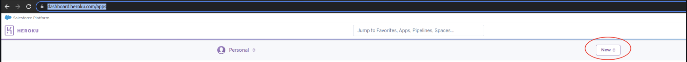
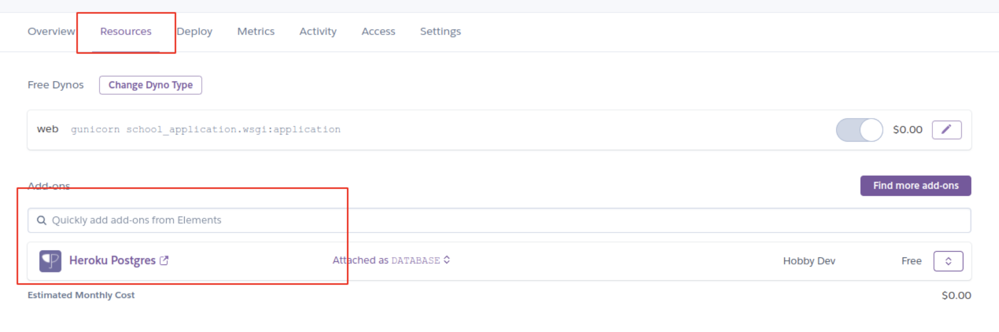
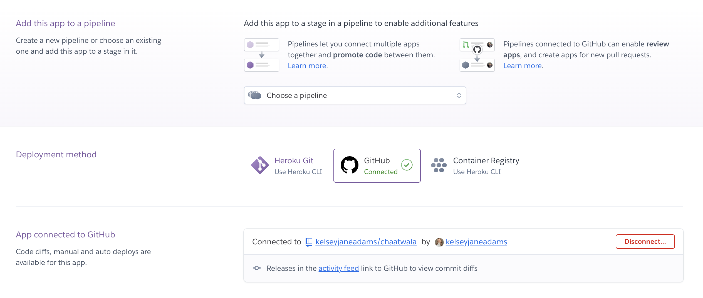
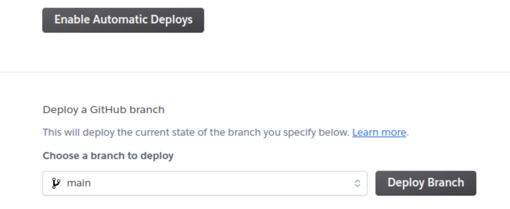
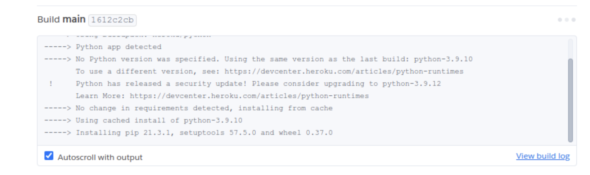
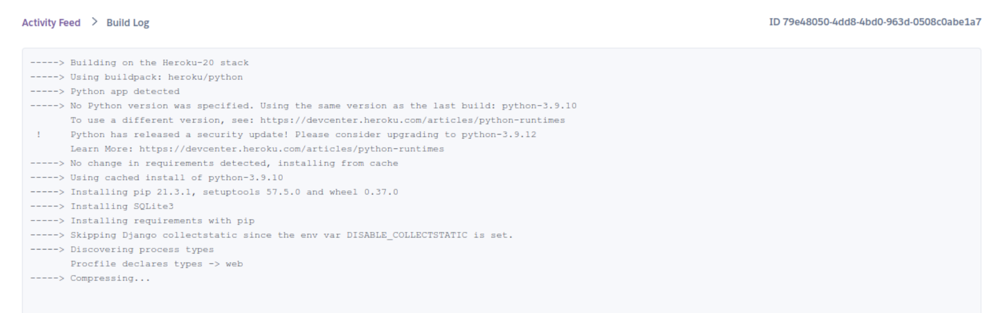

# **Deployment**

- The app was deployed to **[Heroku](https://www.heroku.com/)**.
- The database was deployed to **[PostgreSQL](https://www.postgresql.org/)**.
- The app can be accessed at: **[Chaatwala Live Version](https://chaatwala-7c8e5440b10f.herokuapp.com/)**.

## **Local Deployment**

### **Setting Up Locally**
To run this project on your local machine, follow these steps:

1. **Install dependencies:**  
   Open the terminal and run:  
   ```bash
   pip3 install -r requirements.txt

### **Clone the Repository**
To create a local copy of this project, use one of the following methods:

#### **Option 1: Download ZIP File**
1. Go to the **[GitHub Repository](https://github.com/kelseyjaneadams/chaatwala)**.
2. Click the **Code** button and download the ZIP file.
3. Extract the ZIP file to a location on your PC.

#### **Option 2: Clone via Git**
1. Open a terminal and navigate to the desired folder.
2. Run the following command:
   ```bash
   git clone https://github.com/kelseyjaneadams/chaatwala.git

### **Alternative: Open in Gitpod**
If you prefer to use **Gitpod** for development, you can create your own workspace using this repository by clicking the button below:

[](https://gitpod.io/#https://github.com/kelseyjaneadams/chaatwala)

---

1. Install the dependencies:

    - Open the terminal window and type:
    - `pip3 install -r requirements.txt`


1. Create a `.gitignore` file in the root directory of the project where you should add env.py and __pycache__ files to prevent the privacy of your secret data.

1. Create a `.env` file. This will contain the following environment variables:

    ```python
    import os

      os.environ['SECRET_KEY'] = 'Add a secret key'
      os.environ['DATABASE_URL'] = 'will be used to connect to the database'
      os.environ['DEBUG'] = 'True'
    ```

    *During the development stage DEBUG is set to True, but it is vital to change it to False.*

1. Run the following commands in a terminal to make migrations: 
    - `python3 manage.py makemigrations`
    - `python3 manage.py migrate`
1. Create a superuser to get access to the admin environment.
    - `python3 manage.py createsuperuser`
    - Enter the required information (your username, email and password).
1. Run the app with the following command in the terminal:
    - `python3 manage.py runserver`
1. Open the link provided in a browser to see the app.

1. If you need to access the admin page:
    - Add /admin/ to the link provided.
    - Enter your username and password (for the superuser that you have created before).
    - You will be redirected to the admin page.

--- 

# Heroku Deployment

## Step 1: Prepare for Deployment

* Set up a local workspace on your computer for Heroku:
    - Create a list of requirements that the project needs to run:
      - type this in the terminal: `pip3 freeze > requirements.txt`
    - Commit and push the changes to GitHub
    
* Go to [www.heroku.com](www.heroku.com) 
* Log in or create a Heroku account.
* Create a new app with any unique name <name app>.

  

* Create a Procfile in your local workplace:

  
    
    This file will will contain the following:
    ```python
        web: gunicorn <name app>.wsgi:application
    ```
    - Commit and push the changes to GitHub.

    * Go to resources in Heroku and search for postgresql. Select Hobby dev - Free and click on the provision button to add it to the project.

  


* Go to the settings app in Heroku and go to Config Vars.

  

Click on Reveal Config Vars and add the following config variables:

    | Key                     | Value                      |
    |-------------------------|--------------------------|
    | `CLOUDINARY_API_KEY`    | Your Cloudinary API Key  |
    | `CLOUDINARY_API_SECRET` | Your Cloudinary API Secret  |
    | `CLOUDINARY_CLOUD_NAME` | Your Cloudinary Cloud Name  |
    | `DATABASE_URL`          | *(Generated automatically when PostgreSQL is provisioned)* |
    | `DEBUG`                | `False` |
    | `DISABLE_COLLECTSTATIC` | `1` |
    | `SECRET_KEY`            | Your Django Secret Key |

* Copy the value of DATABASE_URL and input it into the .env file and generate a secret key (you may use [Djecrety](https://djecrety.ir/) for secret key generation).
* Migrate changes.
* Set debug to False in settings.py
* Commit and push the changes to GitHub.
* Connect your repository to Heroku.

   

* Deploy the app to Heroku by clicking "Deploy Branch" button. If you want to enable auto-deployment, click "Enable Automatic Deployment".

   


The deployment process will start.

   

Click "View build logs" to see the progress of the deployment.

  


* Due to Heroku security updates, the dashboard may not allow you to deploy directly from GitHub. Instead, use the following commands in your terminal:

| Action                                  | Terminal Command                     | Description |
|-----------------------------------------|--------------------------------------|-------------|
| Log in to Heroku                        | `heroku login -i`                    | Authenticate your Heroku account. |
| Create a new app on Heroku               | `heroku create chaatwala`            | If you haven't created the app before, you can access it via the Heroku dashboard and set up config vars. |
| Add Heroku remote to your local repo     | `heroku git:remote -a chaatwala`     | If you've already created the app on Heroku, connect it using the Heroku dashboard. |
| Deploy a new version of the app          | `git push heroku main`               | Pushes your project to Heroku. |
| Rename your Heroku remote (optional)     | `git remote rename heroku production` | Renames your remote for clarity. |

---

* Final Deployment Steps

1. Set `DEBUG=False` locally in `settings.py`:
    ```python
    DEBUG = False
    ```

2. Remove `DISABLE_COLLECTSTATIC=1` from Heroku Config Vars:
    - Go to **Heroku Dashboard** → **Settings** → **Config Vars**.
    - Click the ❌ (delete) button next to `DISABLE_COLLECTSTATIC`.

3. Commit and push the final deployment settings:
    ```bash
    git add .
    git commit -m "Final Heroku deployment settings"
    git push heroku main
    ```