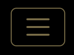
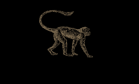
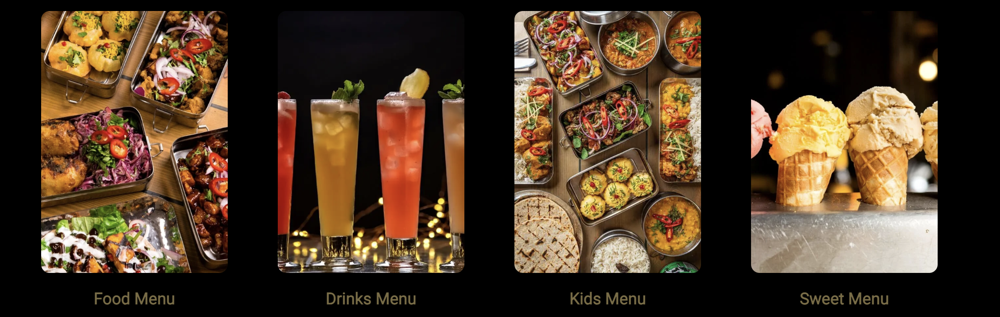

# Chaatwala

## Features

Web application has the following pages:

- Menu/Home Page
- Booking A Table Page
- Log In Page
- Register Page
- Profile Page
- Log Out Page

## 🔑 User & Admin Access Levels for Chaatwala App

### 👥 User Roles & Access Permissions

| Feature | **Regular User** | **Admin** |
|---------|:--------------:|:------:|
| **Authentication & Account Management** | ✅ Can Sign Up, Log In, Log Out | ✅ Full control over all user accounts |
| **Password Reset** | ✅ Can reset own password | ✅ Can reset any user’s password |
| **Profile Management** | ✅ Can update profile picture & view own bookings & reviews | ✅ Can update any user’s profile if needed |
| **Booking System** | ✅ Can create, edit, & cancel own bookings | ✅ Can view, edit, and delete **all** bookings |
| **Booking Status** | ✅ Can see their booking status (Pending, Confirmed, Cancelled) | ✅ Can **change** any booking status |
| **Viewing Restaurant Menus** | ✅ Can view/download menus | ✅ Can update menus (e.g., add new items) |
| **Review System** | ✅ Can submit, edit, and delete their own reviews | ✅ Can **approve/reject/delete** any review |
| **Review Approval Process** | ❌ Cannot approve reviews (must wait for admin) | ✅ Can approve or reject pending reviews |
| **Viewing Other Users' Reviews** | ✅ Can only see **approved** reviews | ✅ Can see **all reviews** (approved & pending) |
| **Deleting Content** | ❌ Cannot delete other users' reviews or bookings | ✅ Can delete **any** review, booking, or user profile |
| **Admin Dashboard Access** | ❌ No access | ✅ Full access to the Django admin panel |
| **Site Settings & Management** | ❌ No access | ✅ Can update menus, change business hours, and manage users |

---

## Navbar

### Logged Out User

### Logged In User

Navbar has the following links:
- Menus Page
- Booking a Table Page
- Register Page
- Log In Page

When a user signs up/logs in then the following pages appear on the Navbar:
- Menus Page
- Booking a Table Page
- Profile Page
- Log Out Page

The Navbar has a logo of the Restauraunt.

The Navabar also turns into a Burger on smaller screens. 

The design of the Navbar is kept simple so the User can easily navigate their way through the website.

## Logo 

This logo when clicked redirects to the Home/Menu Page.

## Footer

The Footer has 5 Social Media links which take the User to the relevant Social Media page in a new tab once clicked.

## Hero Image

The Hero image displays the inside of the restuaraunt to the User so they can get a feel for the aesthetic.

## Menu Title 

The Menu title communicates to the User the beginning of the Menu section.

## Menus 

There are 4 Menu Options:
- Food Menu
- Drinks Menu
- Kids Menu
- Sweet Menu

The Menu choices, once clicked, open the Menu images in a new tab so the User can review the food and drink options.

