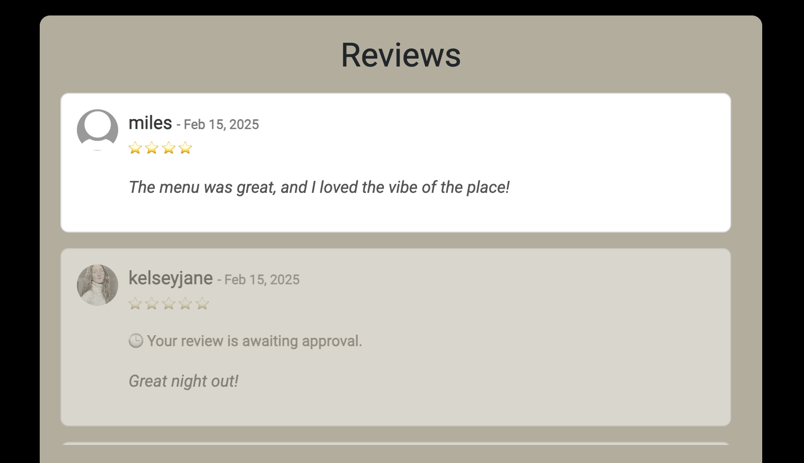
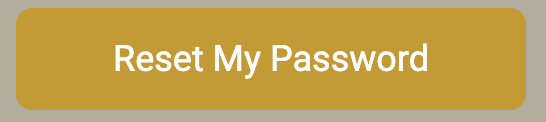

# Chaatwala

## Features

The Chaatwala web application includes the following pages:

- **Home/Menu Page**
- **Book a Table Page**
- **Log In Page**
- **Register Page**
- **Profile Page**
- **Log Out Page**

---

## 🔑 User & Admin Access Levels

### 👥 User Roles & Permissions

| Feature | **Regular User** | **Admin** |
|---------|:--------------:|:------:|
| **Authentication & Account Management** | ✅ Can sign up, log in, and log out | ✅ Full control over all user accounts |
| **Password Reset** | ✅ Can reset their own password | ✅ Can reset any user’s password |
| **Profile Management** | ✅ Can update their profile picture & view their bookings & reviews | ✅ Can update any user’s profile if needed |
| **Booking System** | ✅ Can create, edit, & cancel their own bookings | ✅ Can view, edit, and delete **all** bookings |
| **Booking Status** | ✅ Can see their booking status (Pending, Confirmed, Cancelled) | ✅ Can **change** any booking status |
| **Review System** | ✅ Can submit, edit, and delete their own reviews | ✅ Can **approve, reject, or delete** any review |
| **Review Approval Process** | ❌ Cannot approve reviews (must wait for admin) | ✅ Can approve or reject pending reviews |
| **Viewing Other Users' Reviews** | ✅ Can only see **approved** reviews | ✅ Can see **all reviews** (approved & pending) |
| **Deleting Content** | ❌ Cannot delete other users' reviews or bookings | ✅ Can delete **any** review, booking, or user profile |
| **Admin Dashboard Access** | ❌ No access | ✅ Full access to the Django admin panel |
| **Site Settings & Management** | ❌ No access | ✅ Can update menus, change business hours, and manage users |

---

## 🛠 Navigation & User Interface

### Navbar

#### Logged-Out Users

#### Logged-In Users

The navbar contains the following links:

- **Menu Page**
- **Book a Table Page**
- **Register Page**
- **Log In Page**

Once a user logs in, additional options appear:

- **Menu Page**
- **Book a Table Page**
- **Profile Page**
- **Log Out Page**

The **restaurant logo** is prominently displayed in the navbar and serves as a clickable link to the **Home/Menu page**.

On smaller screens, the navbar collapses into a **hamburger menu** for better usability.

The design is intentionally simple to ensure easy navigation.

---

## 🎨 Branding & Design

### Logo

Clicking the logo redirects users to the **Home/Menu Page**.

### Footer

The footer includes **five social media links**, which open in new tabs when clicked.

---

## 📸 Visual Highlights

### Hero Image

The hero image provides users with a **glimpse of the restaurant's interior**, allowing them to experience its aesthetic before visiting.

### Menu Title

The **menu title** clearly indicates the beginning of the restaurant's menu section.

### Menu Categories

Users can choose from **four** menu categories:

- **Food Menu**
- **Drinks Menu**
- **Kids Menu**
- **Sweet Menu**

On mobile screens, these options are displayed in **two rows**.

Clicking on a menu option opens a **full menu image** in a new tab.

#### Food Menu

#### Drinks Menu

#### Kids Menu

#### Sweet Menu

---

## ⭐ Reviews Section

The **Reviews section** is located below the menu, providing users with **authentic feedback from previous customers**.

### For Unregistered Users
Users who are **not logged in** will only see **approved reviews** in a **scrollable list**.

To leave a review, users must log in. A **login button** redirects them to the login page. If they don’t have an account, they can register.

### For Logged-In Users
Logged-in users **see all of their own pending reviews**. Pending reviews are **greyed out** and include a **message indicating they are awaiting approval**.

### Review Submission Form
Below the review section, logged-in users can **submit new reviews**.

The form includes:
- **Rating dropdown menu**
- **Comment field**
- **Submit button**

#### Rating Selection
Users can select a **rating from the dropdown**.

#### Review Submit Button
When a user is ready to submit their review, they click the **Submit Review** button.

#### Review Success Flash Message
Upon Submitting the review a success flash message will pop up at the top of the page.

---

## 📅 Booking System

The **Book a Table page** features a **booking form** where users can make reservations.

### Booking Form Fields
- **Contact Name**
- **Number of Guests (Dropdown)**
- **Booking Date (Date Picker)**
- **Booking Time (Hour & Minute Dropdowns)**
- **Special Requests**
- **Submit Button**

### Interactive Form Features
- **Guest Selection (1-6 guests)**
  
  

- **Date Picker (Prevents selecting past dates)**
  
  

- **Hour Selection (Only shows restaurant opening hours)**
  
  

- **Minute Selection (Quarter-hour increments)**
  
  

### Submit Button
Once a user fills out the form, they can click the **Submit Booking** button.

#### Booking Success Flash Message
Upon Submitting the booking a success flash message will pop up at the top of the page.

---

### 🔐 Booking Restrictions for Unregistered Users
If a user is **not logged in**, clicking on "Book a Table" **redirects them to the login page**.

---

## Sign Up Form

The **Register Page** contains a **Sign Up form** that allows users to create an account to make bookings and leave reviews on the website.

### Sign Up Form Fields:
- **Email**
- **Username**
- **Password**
- **Confirm Password**

Once a user fills out the form, they can **sign up** by clicking the **"Sign Up"** button.

If a user decides not to proceed, they can click the **"Cancel"** button, which redirects them to the **Menus/Home page**.

If a user already has an account, they can click the **"Log In"** link at the top of the form, which will redirect them to the **Log In page**.

#### Sign Up Success Flash Message
Upon creating an account, you will be redirected to the Menu/Home page with a success flash message at the top of the page. 

---

## Log In Form

The **Log In page** contains a **Log In form** that allows registered users to access their accounts.

### Log In Form Fields:
- **Username or Email**
- **Password**

After entering their credentials, users can log in by clicking the **"Log In"** button.

If a user has forgotten their password, they can click the **"Forgot Password?"** link to be redirected to the **password reset form**.

If a user does not have an account, they can click the **"Register"** link, which redirects them to the **Sign Up form** to create an account.

---

## Password Reset Form

When a user clicks the forgot password link it takes them to this password reset page with the reset form.

Password Reset Form Fields:
- Email

When the user inputs their email they can reset their password by clicking the Reset Password button

The user can leave the reset password form and go back to the log in page via this link. 

If a user wants to cancel they can click the cancel button which will redirect them to the hmenu/home page.

---

## Profile Image

When a user creates an account a user profile is also created. The user is able to personalise their profile on the profile page by uploading a display picture.

A user will be assigned the default image initially. 

The user clicks the choose file button to select an image from their files. The selected file name will then be displayed in the input field beside the button to communicate a file has been selected.

The user then has to click the upload button to upload the profile image. 

The page will refresh and the new image will be displayed in the profile picture.

A flash success message will also appear at the top of the screen.

---

## Booking Section

A user is able to manage their bookings on their profile page. The booking section displays all previous bookings in a table display format.

Each row includes the following information:
- Date
- Time 
- Guests
- Status
- Actions

To edit the booking the user will click the edit button. 

To delete a booking the user will click the delete button. 

Before a user can delete a booking, a modal will pop up with a final warning to the user of the deletion. The delete button will remove the booking from the users bookings and the database. The cancel button will close the modal.

## Edit Booking

When a user clicks to edit a booking on their bookings section in the prpfile page it will open up an edit booking form with all pre-populated data from their selected booking they want to edit. 

Edit Booking Form Input Fields:
- **Contact Name**
- **Number of Guests (Dropdown)**
- **Booking Date (Date Picker)**
- **Booking Time (Hour & Minute Dropdowns)**
- **Special Requests**
- **Submit Button**

Guest Dropwdown when clicked.

Date picker when clicked.

Booking Hour Dropdown when clicked.

Booking Minute Dropdown when clicked.

When a user has finished editing their booking they click the Update Booking button.

.

A success flash message will appear at the top of the page to confirm this, and users will be able to see the updated booking in their bookings.

