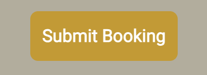
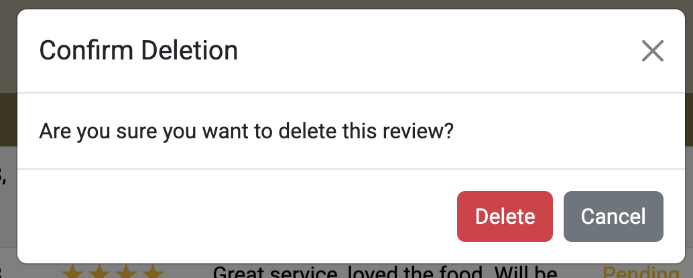
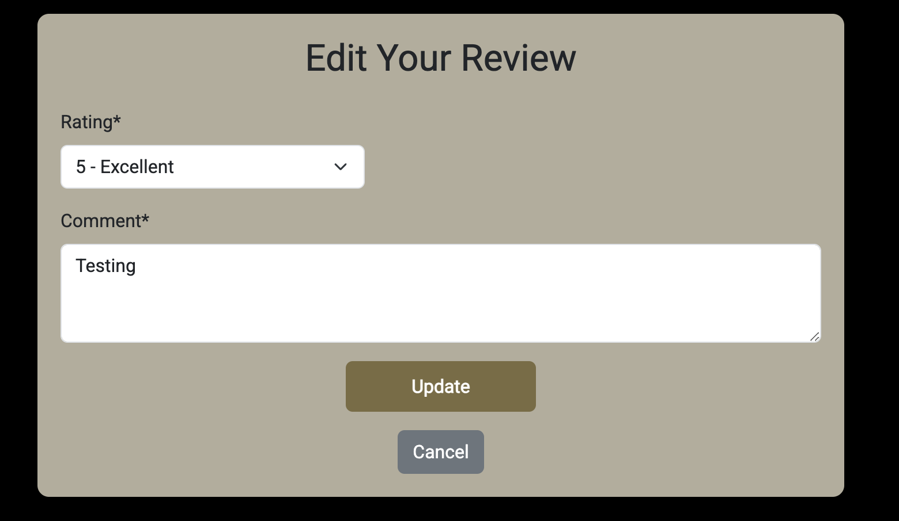
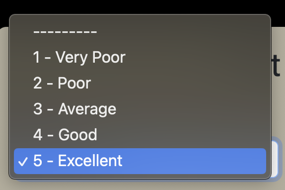
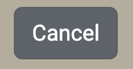

# Chaatwala

## Features

The Chaatwala web application includes the following pages:

- **Home/Menu Page**
- **Book a Table Page**
- **Log In Page**
- **Register Page**
- **Profile Page**
- **Log Out Page**

---

## 🔑 User & Admin Access Levels

### 👥 User Roles & Permissions

| Feature | **Regular User** | **Admin** |
|---------|:--------------:|:------:|
| **Authentication & Account Management** | ✅ Can sign up, log in, and log out | ✅ Full control over all user accounts |
| **Password Reset** | ✅ Can reset their own password | ✅ Can reset any user’s password |
| **Profile Management** | ✅ Can update their profile picture & view their bookings & reviews | ✅ Can update any user’s profile if needed |
| **Booking System** | ✅ Can create, edit, & cancel their own bookings | ✅ Can view, edit, and delete **all** bookings |
| **Booking Status** | ✅ Can see their booking status (Pending, Confirmed, Cancelled) | ✅ Can **change** any booking status |
| **Review System** | ✅ Can submit, edit, and delete their own reviews | ✅ Can **approve, reject, or delete** any review |
| **Review Approval Process** | ❌ Cannot approve reviews (must wait for admin) | ✅ Can approve or reject pending reviews |
| **Viewing Other Users' Reviews** | ✅ Can only see **approved** reviews | ✅ Can see **all reviews** (approved & pending) |
| **Deleting Content** | ❌ Cannot delete other users' reviews or bookings | ✅ Can delete **any** review, booking, or user profile |
| **Admin Dashboard Access** | ❌ No access | ✅ Full access to the Django admin panel |
| **Site Settings & Management** | ❌ No access | ✅ Can update menus, change business hours, and manage users |

---

## 🛠 Navigation & User Interface

### Navbar

#### Logged-Out Users

#### Logged-In Users

The navbar contains the following links:

- **Menu Page**
- **Book a Table Page**
- **Register Page**
- **Log In Page**

Once a user logs in, additional options appear:

- **Menu Page**
- **Book a Table Page**
- **Profile Page**
- **Log Out Page**

The **restaurant logo** is prominently displayed in the navbar and serves as a clickable link to the **Home/Menu page**.

On smaller screens, the navbar collapses into a **hamburger menu** for better usability.

The design is intentionally simple to ensure easy navigation.

---

## 🎨 Branding & Design

### Logo

Clicking the logo redirects users to the **Home/Menu Page**.

### Footer

The footer includes **five social media links**, which open in new tabs when clicked.

---

## 📸 Visual Highlights

### Hero Image

The hero image provides users with a **glimpse of the restaurant's interior**, allowing them to experience its aesthetic before visiting.

### Menu Title

The **menu title** clearly indicates the beginning of the restaurant's menu section.

### Menu Categories

Users can choose from **four** menu categories:

- **Food Menu**
- **Drinks Menu**
- **Kids Menu**
- **Sweet Menu**

On mobile screens, these options are displayed in **two rows**.

Clicking on a menu option opens a **full menu image** in a new tab.

#### Food Menu

#### Drinks Menu

#### Kids Menu

#### Sweet Menu

---

## ⭐ Reviews Section

The **Reviews section** is located below the menu, providing users with **authentic feedback from previous customers**.

### For Unregistered Users
Users who are **not logged in** will only see **approved reviews** in a **scrollable list**.

To leave a review, users must log in. A **login button** redirects them to the login page. If they don’t have an account, they can register.

### For Logged-In Users
Logged-in users **see all of their own pending reviews**. Pending reviews are **greyed out** and include a **message indicating they are awaiting approval**.

### Review Submission Form
Below the review section, logged-in users can **submit new reviews**.

The form includes:
- **Rating dropdown menu**
- **Comment field**
- **Submit button**

#### Rating Selection
Users can select a **rating from the dropdown**.

#### Review Submit Button
When a user is ready to submit their review, they click the **Submit Review** button.

#### Review Success Flash Message
Upon Submitting the review a success flash message will pop up at the top of the page.

---

## 📅 Booking System

The **Book a Table page** features a **booking form** where users can make reservations.

### Booking Form Fields
- **Contact Name**
- **Number of Guests (Dropdown)**
- **Booking Date (Date Picker)**
- **Booking Time (Hour & Minute Dropdowns)**
- **Special Requests**
- **Submit Button**

### Interactive Form Features
- **Guest Selection (1-6 guests)**
  
  

- **Date Picker (Prevents selecting past dates)**
  
  

- **Hour Selection (Only shows restaurant opening hours)**
  
  

- **Minute Selection (Quarter-hour increments)**
  
  

### Submit Button
Once a user fills out the form, they can click the **Submit Booking** button.

#### Booking Success Flash Message
Upon Submitting the booking a success flash message will pop up at the top of the page.

---

### 🔐 Booking Restrictions for Unregistered Users
If a user is **not logged in**, clicking on "Book a Table" **redirects them to the login page**.

---

## Sign Up Form

The **Register Page** contains a **Sign Up form** that allows users to create an account to make bookings and leave reviews on the website.

### Sign Up Form Fields:
- **Email**
- **Username**
- **Password**
- **Confirm Password**

Once a user fills out the form, they can **sign up** by clicking the **"Sign Up"** button.

If a user decides not to proceed, they can click the **"Cancel"** button, which redirects them to the **Menus/Home page**.

If a user already has an account, they can click the **"Log In"** link at the top of the form, which will redirect them to the **Log In page**.

#### Sign Up Success Flash Message
Upon creating an account, you will be redirected to the Menu/Home page with a success flash message at the top of the page. 

---

## Log In Form

The **Log In page** contains a **Log In form** that allows registered users to access their accounts.

### Log In Form Fields:
- **Username or Email**
- **Password**

After entering their credentials, users can log in by clicking the **"Log In"** button.

If a user has forgotten their password, they can click the **"Forgot Password?"** link to be redirected to the **password reset form**.

If a user does not have an account, they can click the **"Register"** link, which redirects them to the **Sign Up form** to create an account.

#### Sign In Success Flash Message
When a user signs into their account succesfully they will be redirected to the home page with a success flash message that will appear at the top of the page Menu/Home page.

---

## 🔑 Password Reset Form

When a user clicks the **"Forgot Password"** link, they are redirected to the password reset page, where they can enter their email to receive reset instructions.

### Password Reset Form Fields:
- **Email**

After entering their email, the user can click the **"Reset Password"** button to proceed.

If the user wishes to return to the **Log In page**, they can click the **"Back to Log In"** link.

Alternatively, the **"Cancel"** button redirects the user back to the **Home/Menu page**.

---

## 🖼️ Profile Image

When a user creates an account, a profile is automatically generated. Users can personalize their profile by uploading a **display picture** from the **Profile page**.

### Default Profile Image
Upon account creation, users are assigned a **default profile image**.

### Uploading a Profile Image
To change their profile picture, the user must:
1. Click the **"Choose File"** button to select an image.
2. The selected file name will be displayed beside the button.
3. Click **"Upload"** to save the new image.

Once uploaded, the page refreshes, and the new profile image appears.

A **success flash message** confirms the update.

---

## 📅 Booking Management

Users can **view, edit, and delete** their bookings from the **Profile page**. Bookings are displayed in a structured table format.

### Booking Table Columns:
- **Date**
- **Time**
- **Guests**
- **Status** *(Pending, Confirmed, or Cancelled)*
- **Actions** *(Edit or Delete)*

### Managing Bookings

- **Editing a Booking:** Clicking the **"Edit"** button opens the booking form with pre-filled details.
- **Deleting a Booking:** Clicking the **"Delete"** button prompts a confirmation modal.

Before deletion, a **confirmation modal** appears, giving the user the option to proceed or cancel.

---

## ✏️ Editing a Booking

When a user selects **"Edit"** from their bookings list, they are taken to the **Edit Booking** form, where they can modify their reservation details.

### Booking Form Fields:
- **Contact Name**
- **Number of Guests (Dropdown)**
- **Booking Date (Date Picker)**
- **Booking Time (Hour & Minute Dropdowns)**
- **Special Requests**
- **Update Booking Button**

#### Interactive Form Features:
- **Guest Selection** *(Dropdown for 1-6 guests)*  
  

- **Date Picker** *(Prevents selecting past dates)*  
  

- **Hour Selection** *(Displays available restaurant hours only)*  
  

- **Minute Selection** *(Offers quarter-hour increments)*  
  

Once the user finalizes their changes, they click **"Update Booking"** to save the edits.

A **success flash message** confirms the update, and the user is redirected to their **Bookings page**.

---

## ⭐ Review Management

Users can view and manage their **submitted reviews** on the **Profile page**. Reviews are displayed in a structured table format.

### Review Table Columns:
- **Date**
- **Rating** *(Displayed as stars)*
- **Comment**
- **Status** *(Approved or Pending)*
- **Actions** *(Edit or Delete)*

### Managing Reviews

- **Editing a Review:** Clicking the **"Edit"** button opens the review form with pre-filled details.
- **Deleting a Review:** Clicking the **"Delete"** button prompts a confirmation modal.

Before deletion, a **confirmation modal** appears, requiring final confirmation.

#### Review Deletion Confirmation
When a user successfully deletes a review, a **success flash message** appears.

---

## ✏️ Editing a Review

When a user selects **"Edit"** from their review list, they are taken to the **Edit Review** form, where they can update their feedback.

### Review Form Fields:
- **Rating** *(Dropdown menu)*
- **Comment** *(Text area)*
- **Update Review Button**

#### Interactive Form Features:
- **Rating Selection** *(Dropdown for 1-5 stars)*  
  

Once the user finalizes their changes, they click **"Update Review"** to save the edits.

If the user chooses to cancel, clicking the **"Cancel"** button redirects them back to the **Profile page**.

Upon a successful update, a **success flash message** appears on the **Profile page**.

---

## Favicon

The favicon is a small image that is displayed in the browser's address bar. It is used to identify the website among others and help the user to find it when he/she is searching for it.

