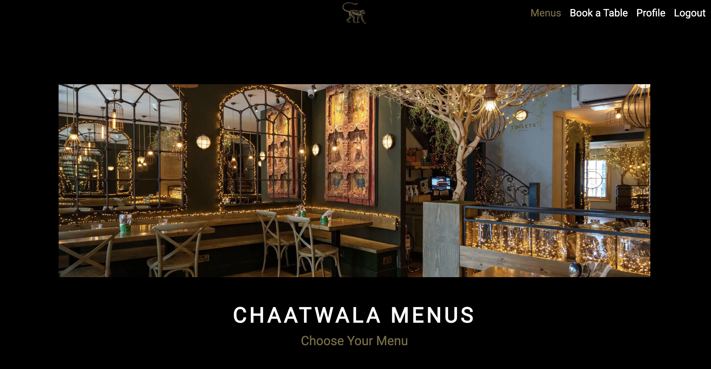

# **Chaatwala**  

🔗 **Live Version:** [Chaatwala on Heroku](https://chaatwala-7c8e5440b10f.herokuapp.com/)  

📂 **Repository:** [GitHub - Chaatwala](https://github.com/kelseyjaneadams/chaatwala)  

👤 **Developer:** [Kelsey Adams](https://github.com/kelseyjaneadams)  

## About

Chaatwala is a restaurant booking system designed for an Indian street food establishment. Users must register an account to make bookings or submit reviews. Upon account creation, a profile is automatically generated, allowing users to manage their reservations and feedback seamlessly.

## Strategy

The platform aims to streamline restaurant reservations while fostering user engagement through a review system. By requiring user registration, Chaatwala ensures a personalized experience, enabling efficient booking management and feedback tracking. The system also provides administrators with tools to oversee reservations and user reviews, ensuring smooth operations and content moderation.

## Target Audience

Chaatwala is designed for food enthusiasts who enjoy authentic Indian street food and seek a hassle-free booking experience. The target audience includes:
- Users: Initial site visitors exploring the restaurant’s offerings before deciding to register.
- Registered Users: Customers who have created an account to book a table and manage their reservations. Also to leave reviews once visited.
- Site Owners: Senior staff members responsible for overseeing bookings, managing reviews, and ensuring smooth operations.

## User Stories

### User Goals
| Issue ID    | User Story |
|-------------|-------------|
|[#4](https://github.com/users/kelseyjaneadams/projects/3/views/1?pane=issue&itemId=93873080&issue=kelseyjaneadams%7Cchaatwala%7C4)| As a User, I can register an account so that I can comment a review/make a booking.|
|[#5](https://github.com/users/kelseyjaneadams/projects/3/views/1?pane=issue&itemId=93874560&issue=kelseyjaneadams%7Cchaatwala%7C5)|As a User, I can click on a menu so that I can view the corresponding full menu images in a new tab for detailed information.|
|[#11](https://github.com/users/kelseyjaneadams/projects/3/views/1?pane=issue&itemId=93881333&issue=kelseyjaneadams%7Cchaatwala%7C11)|As a user, I want to read reviews left by other customers so that I can make an informed decision about the service offered.|

### Registered User Goals

| Issue ID    | User Story |
|-------------|-------------|
|[#1](https://github.com/users/kelseyjaneadams/projects/3?pane=issue&itemId=93870456&issue=kelseyjaneadams%7Cchaatwala%7C1)| As a registered User I can fill out a Booking Form so that I can submit a booking request.|
|[#14](https://github.com/users/kelseyjaneadams/projects/3/views/1?pane=issue&itemId=99948307&issue=kelseyjaneadams%7Cchaatwala%7C14)|As a registered User, I want to edit my submitted bookings so that I can make changes to the original booking.|
|[#13](https://github.com/users/kelseyjaneadams/projects/3/views/1?pane=issue&itemId=95173792&issue=kelseyjaneadams%7Cchaatwala%7C13)|As a registered User, I can manage my profile, including uploading a profile picture, so that I can personalise my account and improve the user experience.|
|[#6](https://github.com/users/kelseyjaneadams/projects/3/views/1?pane=issue&itemId=93876146&issue=kelseyjaneadams%7Cchaatwala%7C6)|As a registered User, I can submit a review with a rating and comment so that I can share my feedback on the service.|
|[#9](https://github.com/users/kelseyjaneadams/projects/3/views/1?pane=issue&itemId=93879764&issue=kelseyjaneadams%7Cchaatwala%7C9)|As a registered User, I want to edit my submitted reviews so that I can update or correct my feedback.|
|[#10](https://github.com/users/kelseyjaneadams/projects/3/views/1?pane=issue&itemId=93880223&issue=kelseyjaneadams%7Cchaatwala%7C10)|As a registered User, I want to delete my submitted reviews so that I can remove feedback that I no longer wish to share.|
|[#15](https://github.com/users/kelseyjaneadams/projects/3/views/1?pane=issue&itemId=99948269&issue=kelseyjaneadams%7Cchaatwala%7C15)|As a registered User, I want to delete my submitted booking as I way to cancel my reservation at the restaurant.|
[#14](https://github.com/users/kelseyjaneadams/projects/3/views/1?pane=issue&itemId=99948307&issue=kelseyjaneadams%7Cchaatwala%7C14)|As a registered User, I want to edit my submitted bookings so that I can make changes to the original booking.|

#### Site Owner Goals
| Issue ID    | User Story |
|-------------|-------------|
|[#7](https://github.com/users/kelseyjaneadams/projects/3/views/1?pane=issue&itemId=93877003&issue=kelseyjaneadams%7Cchaatwala%7C7)|As a site owner, I can approve pending user reviews so that only appropriate and relevant content is displayed on the site.|
|[#8](https://github.com/users/kelseyjaneadams/projects/3/views/1?pane=issue&itemId=93878979&issue=kelseyjaneadams%7Cchaatwala%7C8)|As a site owner, I can delete pending or existing user reviews so that inappropriate or irrelevant content is removed from the site.|
|[#12](https://github.com/users/kelseyjaneadams/projects/3/views/1?pane=issue&itemId=93881533&issue=kelseyjaneadams%7Cchaatwala%7C12)|As a site owner, I want to access and review all user-submitted reviews so that I can monitor feedback and ensure content appropriateness.|
|[#16](https://github.com/users/kelseyjaneadams/projects/3/views/1?pane=issue&itemId=99948460&issue=kelseyjaneadams%7Cchaatwala%7C16)|As a site owner, I want to access and review all user-submitted bookings so that I can manage reservations effectively and ensure smooth scheduling.|
|[#17](https://github.com/users/kelseyjaneadams/projects/3/views/1?pane=issue&itemId=99950394&issue=kelseyjaneadams%7Cchaatwala%7C17)|As a site owner, I can delete pending or existing user bookings so that unavailable or incorrect reservations are removed from the system.|
|[#18](https://github.com/users/kelseyjaneadams/projects/3/views/1?pane=issue&itemId=99950427&issue=kelseyjaneadams%7Cchaatwala%7C18)|As a site owner, I can confirm pending user bookings so that reservations are properly validated and scheduled.|

## Technologies Used

- ### Languages:
    
    + [Python](https://www.python.org/): The primary language used to develop the server-side of the website.

- ### Frameworks and Libraries:

    + [Django 4.2.18](https://www.djangoproject.com/): Python framework used to create all the logic.
    + [Django Allauth 0.57.2](https://django-allauth.readthedocs.io/en/latest/): Authentication library used to handle user accounts and social logins.
    + [Django Crispy Forms 2.3](https://django-crispy-forms.readthedocs.io/en/latest/): Used to control the rendering behavior of Django forms.
    + [Django Summernote 0.8.20.0](https://github.com/summernote/django-summernote): Used to provide a rich-text editor for user-generated content.
    + [Crispy Bootstrap 5 2024.10](https://github.com/django-crispy-forms/crispy-bootstrap5): Adds Bootstrap 5 styling support for Django Crispy Forms.
    + [Cloudinary 1.42.2](https://cloudinary.com/): Used for media file storage and management.

- ### Databases:

    + [PostgreSQL](https://www.postgresql.org/): The primary database used to store all the data.
    + [dj-database-url 0.5.0](https://github.com/jacobian/dj-database-url): Used to configure the database connection.
    + [psycopg2 2.9.10](https://www.psycopg.org/): The database adapter used to connect Django to PostgreSQL.

- ### Authentication & Security:

    + [PyJWT 2.10.1](https://pyjwt.readthedocs.io/en/stable/): Used for handling JSON Web Tokens (JWT) for authentication.
    + [OAuthlib 3.2.2](https://oauthlib.readthedocs.io/en/latest/): Library used to implement OAuth authentication.
    + [Requests-OAuthlib 2.0.0](https://requests-oauthlib.readthedocs.io/en/latest/): Extension for handling OAuth authentication via HTTP requests.
    + [Python3-OpenID 3.2.0](https://github.com/openid/python-openid): Used to handle OpenID authentication.
    + [Cryptography 44.0.0](https://cryptography.io/en/latest/): Used for encryption and security operations.

- ### Dependencies & Utilities:

    + [asgiref 3.8.1](https://pypi.org/project/asgiref/): Provides ASGI support for Django applications.
    + [Bleach 6.2.0](https://bleach.readthedocs.io/en/latest/): Used to sanitize user-generated content.
    + [DefusedXML 0.7.1](https://pypi.org/project/defusedxml/): Used to prevent XML-related security vulnerabilities.
    + [Sqlparse 0.5.3](https://github.com/andialbrecht/sqlparse): Used for parsing SQL queries.
    + [Pillow 11.1.0](https://pillow.readthedocs.io/en/stable/): Python imaging library used for image processing.
    + [Charset Normalizer 3.4.1](https://github.com/Ousret/charset_normalizer): Used for character encoding detection.
    + [Setuptools 75.8.0](https://pypi.org/project/setuptools/): Used to manage Python package installations.

- ### Networking & HTTP:

    + [Requests 2.32.3](https://requests.readthedocs.io/en/latest/): Used to send HTTP requests.
    + [urllib3 2.3.0](https://urllib3.readthedocs.io/en/stable/): Provides additional HTTP functionality.
    + [Idna 3.10](https://pypi.org/project/idna/): Used for handling internationalized domain names.

- ### Web Server & Static Files:

    + [Gunicorn 20.1.0](https://gunicorn.org/): The web server used to run the Django application.
    + [Whitenoise 5.3.0](https://whitenoise.evans.io/en/stable/): Used to serve static files efficiently.

- ### Other Tools:

    + [Git](https://git-scm.com/): The version control system used to manage the code.
    + [GitHub](https://github.com/): Used to host the website's source code.
    + [Pip](https://pypi.org/project/pip/): The package manager used to install dependencies.
    + [VSCode](https://code.visualstudio.com/): The IDE used to develop the website.
    + [Web Encodings 0.5.1](https://pypi.org/project/webencodings/): Used to support encoding operations.

## Features

Please refer to the [FEATURES.md](FEATURES.md) file for all features-related documentation.

---

## Design

The design of the Chaatwala restaurant booking system focuses on simplicity, elegance, and usability while maintaining an aesthetic that aligns with the essence of Indian street food. The interface is clean and modern, ensuring an intuitive user experience with well-structured navigation and accessible interactions.

- **Minimalist Layout:** A structured interface that prioritizes usability and efficiency.
- **Visual Hierarchy:** Important actions, such as booking and reviewing, are emphasized through contrasting colors and button styles.
- **Consistency:** A uniform design system is applied across all pages, ensuring a cohesive user experience.

## Color Scheme

The color scheme is inspired by earthy, warm, and neutral tones, evoking the authenticity and vibrancy of Indian street food culture while maintaining a professional and inviting interface.

- **Background Color:**
  - **Black (#000000):** A deep black that provides a strong foundation for the interface, allowing other colors to stand out effectively.

- **Primary Colors:**
  - **Coyote (#7A6B42):** A warm, earthy brown that reflects natural tones and a rustic, authentic feel.
  - **Khaki (#B3AD9B):** A soft, muted beige that adds warmth and neutrality to the design.

- **Secondary Colors:**
  - **Silver (#CCCCCC):** A sleek, modern gray used for subtle accents, borders, and secondary text.
  - **Seasalt (#F9F9F9):** A near-white shade that enhances readability and provides contrast against the dark background.

This palette creates a balanced, elegant, and inviting visual experience, ensuring usability and aesthetic appeal. The **dark background** enhances contrast, making text and UI elements pop while maintaining a sophisticated and modern feel.

## Typography

The **Roboto (400 weight)** font was chosen for the Chaatwala booking system due to its **clarity, consistency, and modern appeal**.  

  

- **High Readability:** Its even stroke weight ensures clear, comfortable reading across all devices.  
- **Friendly & Professional:** A geometric yet slightly rounded design makes the interface inviting yet polished.  
- **Optimized for Dark Backgrounds:** Maintains strong contrast and legibility against the black (#000000) background.  
- **Consistency & Minimalism:** A single weight keeps the design clean, structured, and distraction-free.  

Using **Roboto 400** enhances **user experience, accessibility, and design simplicity**, making it ideal for a seamless booking experience.

## Imagery  

All images used in the Chaatwala booking system were sourced from **[Mowgli's Restaurant](https://www.mowglistreetfood.com/)** website. These images were chosen to align with the theme of authentic Indian street food, enhancing the visual appeal and creating an immersive experience for users.  

By using **high-quality, restaurant-specific images**, the platform maintains a **cohesive and inviting aesthetic**, reinforcing the identity of Chaatwala as an Indian dining experience.  

⚠ **Image Attribution:** All images remain the property of **[Mowgli's Restaurant](https://www.mowglistreetfood.com/)** and are used solely for design and demonstration purposes.

---

## Icons 

The **Font Awesome** icon library was used for the social media icons in the footer, ensuring a clean, scalable, and visually consistent design.  

🔗 **Font Awesome Website:** [https://fontawesome.com/](https://fontawesome.com/)

---

## Wireframes 

 
  
   

--- 

## ERD Representation

#### Users

#### Bookings

#### Reviews

#### Profile

#### Relationship Overview

Users (1) ↔ (1) Profile  → Each user has exactly one profile.

Users (1) ↔ (M) Bookings → A user can make multiple bookings.

Users (1) ↔ (M) Reviews  → A user can submit multiple reviews.

Bookings (M) ↔ (1) Users  → Each booking belongs to one user.

Reviews (M) ↔ (1) Users   → Each review is submitted by one user.

---

## Information Architecture

### Database

* During the earliest stages of the project, the database was created using SQLite.
* The database was then migrated to PostgreSQL.

---

## **Data Modeling**

#### **1. Booking**
Model representing a table booking.

| Name              | Database Key     | Field Type    | Validation |
|------------------|----------------|--------------|------------|
| User            | user           | ForeignKey (User) | on_delete=models.CASCADE |
| Contact Name    | contact_name   | CharField    | max_length=50, blank=False |
| Number of Guests | number_of_guests | IntegerField | choices=GUEST_CHOICES (1-6) |
| Booking Date    | booking_date   | DateField    | Cannot be in the past |
| Booking Time    | booking_time   | TimeField    | Required |
| Special Request | special_request | TextField    | max_length=500, blank=True, null=True |
| Status         | status         | CharField    | choices=STATUS_CHOICES (Pending, Confirmed, Cancelled), default="Pending" |

#### **Validation & Business Logic**
- **Past Date Restriction:** `booking_date` cannot be set in the past.
- **Status Reset on Update:** If a confirmed booking is modified (`date/time/guests`), status reverts to **"Pending"**.
- **String Representation:** Displays booking details as `"Booking by {user} for {guests} on {date} at {time}"`.

#### **2. Review**
Model representing user reviews.

| Name         | Database Key  | Field Type    | Validation |
|-------------|--------------|--------------|------------|
| User        | user         | ForeignKey (User) | on_delete=models.CASCADE |
| Rating      | rating       | IntegerField | choices=RATING_CHOICES (1-5) |
| Comment     | comment      | CharField    | max_length=500, blank=False |
| Created On  | created_on   | DateTimeField | auto_now_add=True |
| Status      | status       | CharField    | choices=STATUS_CHOICES (Pending, Approved), default="Pending" |

#### **Validation & Business Logic**
- **Automatic Status Reset:** If an approved review is updated, its status is reset to **"Pending"**.
- **String Representation:** Displays review details as `"Review by {user} with rating {rating}"`.

#### **3. Profile**
Model storing additional user information, such as profile images.

| Name  | Database Key | Field Type      | Validation |
|-------|------------|----------------|------------|
| User  | user      | OneToOneField (User) | on_delete=models.CASCADE |
| Image | image     | CloudinaryField | default="profile_pics/default" |

#### **Validation & Business Logic**
- **One-to-One Relationship:** Each profile is uniquely linked to a single user.
- **Default Profile Image:** If no image is uploaded, a default image (`profile_pics/default`) is used.
- **String Representation:** Displays profile details as `"{user}'s Profile"`.

---

## Testing

Please refer to the [TESTING.md](TESTING.md) file for all test-related documentation.

---

## Deployment

- The app was deployed to **[Heroku](https://www.heroku.com/)**.
- The database was deployed to **[PostgreSQL](https://www.postgresql.org/)**.
- The app can be accessed at: **[Chaatwala](https://chaatwala-7c8e5440b10f.herokuapp.com/)**

Please refer to the [DEPLOYMENT.md](DEPLOYMENT.md) file for all deployment-related documentation.

---