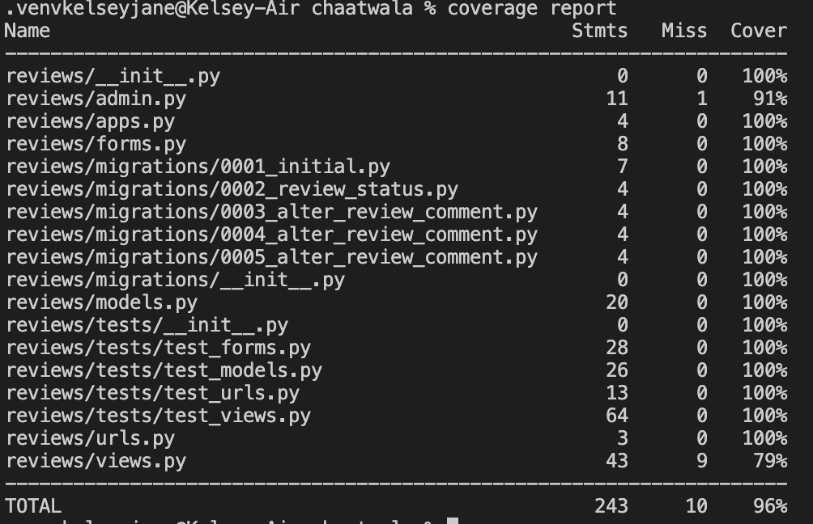
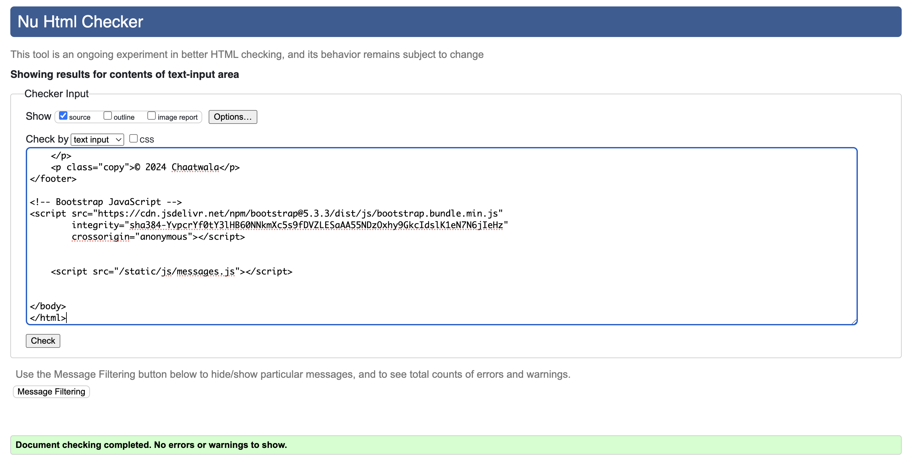

# Testing

## Manual Testing

Testing was done throughout site development.

Usability was tested with the below user acceptance testing.

## Navbar
| #  | User Actions                                | Expected Results                                        | Y/N | Comments |
|----|-------------------------------------------|--------------------------------------------------------|-----|----------|
| 1  | Visit the website                         | Navbar loads and is visible at the top                | Y   |          |
| 2  | Click on "Menus"                          | Redirects to the home page                            | Y   |          |
| 3  | Click on "Book a Table"                   | Redirects to the bookings page                        | Y   |          |
| 4  | Click on "Profile" (while logged in)      | Redirects to the user's profile page                  | Y   |          |
| 5  | Click on "Logout" (while logged in)       | User is logged out and redirected to home page        | Y   |          |
| 6  | Click on "Register" (while logged out)    | Redirects to the sign-up page                         | Y   |          |
| 7  | Click on "Login" (while logged out)       | Redirects to the login page                           | Y   |          |
| 8  | Click the mobile menu (hamburger icon)    | Expands the navigation menu                          | Y   |          |
| 9  | Click outside the mobile menu             | The mobile menu collapses                            | Y   |          |


## Footer

| #  | User Actions                                | Expected Results                                        | Y/N | Comments |
|----|-------------------------------------------|--------------------------------------------------------|-----|----------|
| 1  | Visit any page on the website             | Footer is visible at the bottom of the page           | Y   |          |
| 2  | Click on the Facebook icon                | Opens Facebook in a new tab                           | Y   |          |
| 3  | Click on the Twitter icon                 | Opens Twitter in a new tab                            | Y   |          |
| 4  | Click on the Instagram icon               | Opens Instagram in a new tab                          | Y   |          |
| 5  | Click on the YouTube icon                 | Opens YouTube in a new tab                            | Y   |          |
| 6  | Click on the TikTok icon                  | Opens TikTok in a new tab                             | Y   |          |
| 7  | Check the copyright text                  | Displays "© 2024 Chaatwala"                          | Y   |          |

## Menus/Home Page

| #  | User Actions                         | Expected Results                                          | Y/N | Comments |
|----|--------------------------------------|----------------------------------------------------------|-----|----------|
| **Hero Section** | | | | |
| 1  | Load the home page                   | The hero image should be visible at the top              | Y   |          |
| **Menu Section** | | | | |
| 2  | Scroll to menu section               | Menu heading and subheading should be displayed          | Y   |          |
| 3  | Click on "Food Menu" image           | Opens the Food Menu in a new tab                         | Y   |          |
| 4  | Click on "Drinks Menu" image         | Opens the Drinks Menu in a new tab                       | Y   |          |
| 5  | Click on "Kids Menu" image           | Opens the Kids Menu in a new tab                         | Y   |          |
| 6  | Click on "Sweet Menu" image          | Opens the Sweet Menu in a new tab                        | Y   |          |
| **Customer Reviews Section** | | | | |
| 7  | Scroll to reviews section            | Reviews heading should be visible                        | Y   |          |
| 8  | Check for reviews                     | Approved reviews should be displayed                     | Y   |          |
| 9  | Check for pending reviews            | Pending reviews should only be visible to their authors  | Y   |          |
| 10 | Submit a review (logged in user)     | Review should be added and appear with "Pending" status  | Y   |          |
| 11 | Submit a review (not logged in)      | User should be prompted to log in                        | Y   |          |
| **Navigation & Buttons** | | | | |
| 12 | Click "Log in to leave a review"     | Redirects to login page                                  | Y   |          |
| 13 | Click "Submit Review" (empty form)   | Validation errors should appear                          | Y   |          |

## Booking Page

| #  | User Actions                          | Expected Results                                    | Y/N | Comments |
|----|--------------------------------------|--------------------------------------------------|-----|----------|
| 1  | Visit the Booking Page               | The page loads successfully without errors      | Y   |          |
| 2  | Enter a contact name                 | Name is accepted                                | Y   |          |
| 3  | Enter a valid number of guests       | Only numbers 1-6 are accepted                  | Y   |          |
| 4  | Select a valid booking date          | Future dates are allowed, past dates are blocked | Y   |          |
| 5  | Select an hour and minute for time   | Dropdown menus allow selection                 | Y   |          |
| 6  | Enter a special request (optional)   | Text is accepted                               | Y   |          |
| 7  | Submit the booking form              | Confirmation or error flash message | Y   |          |
| 8  | Try submitting without required fields | Form validation error messages appear         | Y   |          |

## Login Page

| #  | User Actions                          | Expected Results                                    | Y/N | Comments |
|----|--------------------------------------|--------------------------------------------------|-----|----------|
| 1  | Visit the Login Page                 | The page loads successfully without errors      | Y   |          |
| 2  | Enter a valid email/username         | Input is accepted                               | Y   |          |
| 3  | Enter a valid password               | Input is accepted                               | Y   |          |
| 4  | Click "Log In" button with valid credentials | User is redirected to the home page | Y   |          |
| 5  | Click "Log In" button with incorrect credentials | Displays an error message                     | Y   |          |
| 6  | Click "Forgot Password?" link        | Redirects to password reset page               | Y   |          |
| 7  | Click "Register here" link           | Redirects to the registration page             | Y   |          |
| 8  | Click "Cancel" button                | Redirects to the home page                     | Y   |          |
| 9  | Submit the form with empty fields    | Displays validation errors                     | Y   |          |

## Sign Up Page

| #  | User Actions                          | Expected Results                                      | Y/N | Comments |
|----|--------------------------------------|----------------------------------------------------|-----|----------|
| 1  | Visit the Sign Up Page               | The page loads successfully without errors        | Y   |          |
| 2  | Enter a valid email                  | Input is accepted                                 | Y   |          |
| 3  | Enter a valid username               | Input is accepted                                 | Y   |          |
| 4  | Enter a valid password               | Input is accepted                                 | Y   |          |
| 5  | Enter matching passwords             | Input is accepted                                 | Y   |          |
| 6  | Click "Sign Up" button with valid credentials | User is redirected to the home page with a confirmation message | Y   |          |
| 7  | Click "Sign Up" button with invalid credentials | Displays validation error messages               | Y   |          |
| 8  | Leave required fields empty and submit | Displays validation error messages               | Y   |          |
| 9  | Click "Log in" link                  | Redirects to the login page                       | Y   |          |
| 10 | Click "Cancel" button                | Redirects to the home page                        | Y   |          |

## Log Out Page

| #  | User Actions                          | Expected Results                                      | Y/N | Comments |
|----|--------------------------------------|----------------------------------------------------|-----|----------|
| 1  | Visit the Log Out Page               | The page loads successfully without errors        | Y   |          |
| 2  | See the "Log Out" heading            | The heading is displayed                          | Y   |          |
| 3  | See the confirmation message         | Message asks "Are you sure you want to log out?" | Y   |          |
| 4  | Click "Log Out" button               | User is logged out and redirected to home/login page | Y   |          |
| 5  | Click "Cancel" button                | User is redirected to the home page               | Y   |          |
| 6  | Try clicking back button after logout | User remains logged out and is redirected to the home page | Y   |          |


## Profile Page

| #  | User Actions                          | Expected Results                                      | Y/N | Comments |
|----|--------------------------------------|------------------------------------------------------|-----|----------|
| **Profile Image Section** | | | | |
| 1  | Load the profile page               | The page loads successfully without errors          | Y   |          |
| 2  | View profile picture                 | Displays the current profile image                 | Y   |          |
| 3  | Upload a new profile picture         | Image uploads successfully and updates the profile | Y   |          |
| **Booking History Section** | | | | |
| 4  | View bookings table                  | Displays a list of all user bookings               | Y   |          |
| 5  | Check for booking statuses           | Booking status (Pending/Confirmed/Cancelled) is correct | Y   |          |
| 6  | Click "Edit" on a booking            | Redirects to the edit booking page                 | Y   |          |
| 7  | Click "Delete" on a booking          | Opens a confirmation modal                         | Y   |          |
| 8  | Confirm delete booking               | The booking is deleted and removed from the table | Y   |          |
| 9  | Cancel delete booking                | Modal closes, no changes made                     | Y   |          |
| **Review History Section** | | | | |
| 10 | View reviews table                   | Displays a list of all user reviews               | Y   |          |
| 11 | Check review statuses                | Review status (Approved/Pending) is correct       | Y   |          |
| 12 | Click "Edit" on a review             | Redirects to the edit review page                 | Y   |          |
| 13 | Click "Delete" on a review           | Opens a confirmation modal                         | Y   |          |
| 14 | Confirm delete review                | The review is deleted and removed from the table  | Y   |          |
| 15 | Cancel delete review                 | Modal closes, no changes made                     | Y   |          |

## Edit Booking Page

| #  | User Actions                           | Expected Results                                       | Y/N | Comments |
|----|----------------------------------------|-------------------------------------------------------|-----|----------|
| **Edit Booking Form** | | | | |
| 1  | Load the edit booking page            | The page loads successfully without errors           | Y   |          |
| 2  | See "Edit Your Booking" heading       | The heading is displayed correctly                   | Y   |          |
| 3  | Contact name field pre-filled         | Displays the previously entered contact name        | Y   |          |
| 4  | Number of guests field pre-filled     | Displays the previously selected number of guests   | Y   |          |
| 5  | Booking date field pre-filled         | Displays the previously selected booking date       | Y   |          |
| 6  | Time selection fields pre-filled      | Hour and minute dropdowns display the correct time | Y   |          |
| 7  | Special requests field pre-filled     | Displays the previously entered special request    | Y   |          |
| 8  | Change contact name                   | Updated name is accepted                            | Y   |          |
| 9  | Change number of guests               | Allows selecting values between 1-6                | Y   |          |
| 10 | Select a new valid booking date       | Future dates are allowed, past dates are blocked   | Y   |          |
| 11 | Select a new valid booking time       | Allows selecting new valid times                   | Y   |          |
| 12 | Enter a new special request           | Text is accepted                                   | Y   |          |
| 13 | Submit the updated booking            | Changes are saved and confirmation message appears | Y   |          |
| 14 | Submit the form with missing fields   | Validation errors appear                           | Y   |          |
| **Navigation & Buttons** | | | | |
| 15 | Click "Update Booking" button         | Form validates and submits successfully            | Y   |          |
| 16 | Refresh the page after submission     | Updated details remain saved                       | Y   |          |


## Edit Review Page

| #  | User Actions                          | Expected Results                                      | Y/N | Comments |
|----|--------------------------------------|------------------------------------------------------|-----|----------|
| **Edit Review Form** | | | | |
| 1  | Load the edit review page            | The page loads successfully without errors          | Y   |          |
| 2  | Check pre-filled review details      | The review rating and comment fields display the correct existing values | Y   |          |
| 3  | Change the rating                    | The new rating value is updated in the form         | Y   |          |
| 4  | Change the review comment            | The new comment text is updated in the form        | Y   |          |
| 5  | Submit the updated review            | Redirects to profile page with updated review      | Y   |          |
| 6  | Try submitting an empty form         | Validation error appears preventing submission     | Y   |          |
| 7  | Click "Cancel" button                | Redirects back to profile page without changes     | Y   |          |

## Bugs

### 🐞 Solved Bugs

### **1️⃣ Fix: Manually Creating IDs for Models**
🔹 **Issue:**  
At the beginning of the project, I attempted to manually assign **ID numbers** for my **Booking** and **Review** models. However, I later realized that **Django automatically handles primary key (ID) generation** for models. My approach was unintentionally overriding Django's built-in behavior. I had to make multiple fixes to the code in the models themselves before realising my simple error.

🔹 **Cause:**  
Django automatically assigns an **auto-incrementing primary key** (`id`) to each model. Manually specifying IDs caused conflicts with Django’s ORM.

🔹 **Fix:**  
I removed the manual ID assignment from both the **Booking** and **Review** models, allowing Django to manage it automatically. This resolved the issue and ensured smooth model operations.

### **2️⃣ Fix: Prevent TypeError in BookingForm**

🔹 **Issue:**  
A **TypeError** occurred due to incorrect handling of **hour and minute choices** in the **BookingForm**. The choices were improperly defined, leading to list concatenation errors and incorrect form behavior.

🔹 **Cause:**  
- The **tuple values were not wrapped inside a list**, causing unintended list operations.
- **HOUR_CHOICES** and **MINUTE_CHOICES** were not using **strings**, leading to form validation issues.
- The **default dropdown option** allowed users to submit an empty value, causing validation errors.

🔹 **Fix:**  
- Wrapped **tuple values inside a list** to ensure correct data structure.
- Converted **HOUR_CHOICES** and **MINUTE_CHOICES** values to **strings** for proper form handling.
- Set a **default placeholder option** in the dropdown, **forcing user selection** and preventing empty submissions.

The BookingForm now properly validates user input and prevents incorrect selections.

### **3️⃣ Fix: Booking Form Submission by Adding URL Route**

🔹 **Issue:**  
The **Booking Form** was failing to submit due to a missing **URL pattern** and an **import error**, preventing form data from being saved to the database.

🔹 **Cause:**  
- A **missing URL route** for the booking form submission caused a **404 error**.
- A **NameError** occurred due to the **Booking model not being imported** correctly.
- The necessary **import statement for handling form submission** was missing, leading to execution failures.

🔹 **Fix:**  
- **Added the missing URL pattern** to properly route form submissions.
- **Fixed the NameError** by ensuring the **Booking model is correctly imported**.
- **Imported the required form handling method** to ensure smooth submission.
- **Tested & verified** that form submissions now **save to the database** and trigger a **success message**.

The Booking Form now submits successfully, saving the data and providing user feedback.

### **4️⃣ Fix: Default Profile Picture Not Generating from Cloudinary**

🔹 **Issue:**  
When a new user registered, their **profile picture was not being set to the default image** as expected. Instead, the profile was created **without an image**, causing broken image links.

🔹 **Cause:**  
- The **Cloudinary default image URL** was not properly set in the **Heroku config vars**, preventing Cloudinary from assigning a fallback image when no profile picture was uploaded.

🔹 **Fix:**  
- **Updated the Heroku config vars** to include the correct **Cloudinary default image URL**.
- **Verified** that upon profile creation, the default image is now **automatically assigned** if no custom profile picture is uploaded.

New users now have a default profile picture assigned correctly, preventing broken image links.

## Known Bugs

There are no known bugs at present.

## Automated Unit Testing

### Django Unit Testing

I knew from the start that implementing automated testing was important. However, I focused on developing functionality first and left testing until the end. While I didn’t encounter many bugs during testing, I still plan to integrate testing alongside development in the future to streamline the process and ensure smoother deployments.

As there are three main apps in this project I will test them seperately. 

## Bookings App


## Reviews App



## Profiles App


## 🛠 Testing & Database Usage  

During testing, the **SQLite database** was used. However, it’s important to note that `db.sqlite3` was **not** used at any point during development—PostgreSQL was the primary database from the very beginning.  

Since `db.sqlite3` is strictly for testing purposes, it **does not contain any sensitive information** and is **not used in the production environment**.  

For a structured testing approach, I created a **separate `tests/` folder for each app**, containing:  
- `test_forms.py`  
- `test_models.py`  
- `test_views.py`  
- `test_urls.py`  

Additionally, I tested the **signals** in the **profiles app** by creating `test_signals.py`, ensuring profile instances were correctly generated upon user creation.  

To maintain a clean and organized project structure, I also removed any unnecessary `test.py` files from all apps.  

While developing tests I was running the following command:

```
python manage.py test <name of the app>
```

To create the coverage report, I ran the following command:

```
coverage run --source=<name of the app> manage.py test
```
```
coverage report
```
To see the html version of the report, I ran the following command:

```
coverage html
```
```
    python3 -m http.server
```
The link to the server will appear. Click the link to see the report and find out which parts of code has not been covered in testing.

## Validation:
### HTML Validation:

#### menus.html


#### bookings.html


#### login.html



#### logout.html


#### signup.html


#### profiles.html


#### edit_booking.html


#### edit_review.html


- No errors or warnings were found when passing through the official [W3C](https://validator.w3.org/) validator. This checking was done manually by copying the view page source code (Ctrl+U) and pasting it into the validator.

### CSS Validation:

- [Full CSS Validation Report](documentation/validation/css_validation.png)

- No errors or warnings were found when passing through the official [W3C (Jigsaw)](https://jigsaw.w3.org/css-validator/#validate_by_uri) validator except for the warnings about the use of css root variables and webkits for the box-shadow. However, css code works perfectly on various devices.

### JS Validation:

- [Full JS Validation Report](documentation/validation/js_validation.png)

- No errors or warning messages were found when passing through the official [JSHint](https://www.jshint.com/) validator. However, the validator has pointed out that the module variable is not used, but this variable is needed for automated testing. Needless to say, as the modern js syntax was used (the Optional Chaining method - `?.`) `/* jshint esversion: 11 */` was added to the top of the file.

### Python Validation:

- [Full Python Validation Report](documentation/validation/python_validation.pdf)

- No errors were found when the code was passed through Valentin Bryukhanov's [online validation tool](http://pep8online.com/). According to the reports, the code is [Pep 8-compliant](https://legacy.python.org/dev/peps/pep-0008/). This checking was done manually by copying python code and pasting it into the validator.


